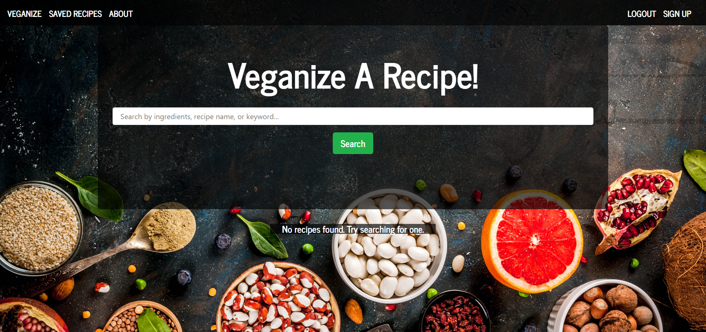
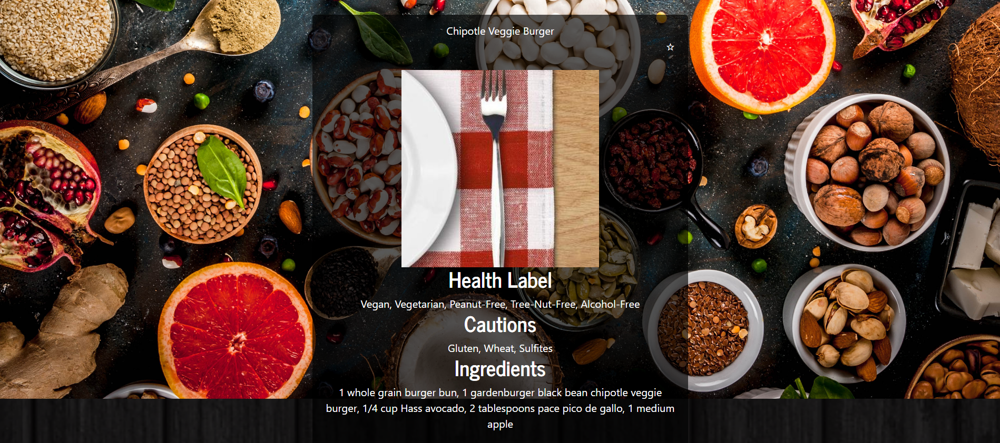
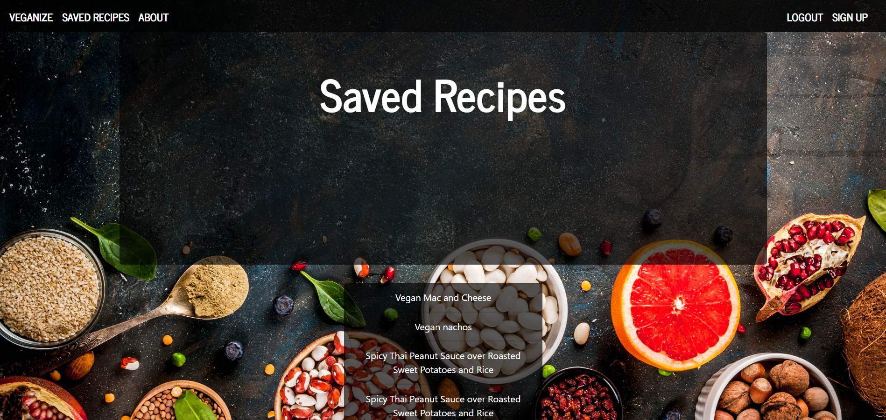
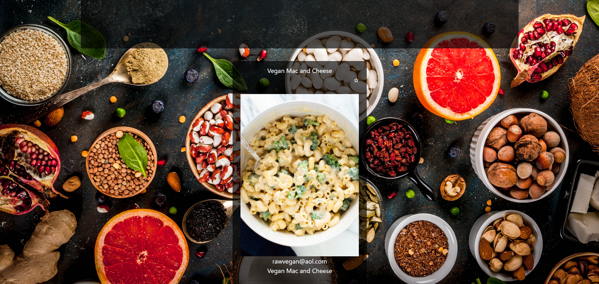
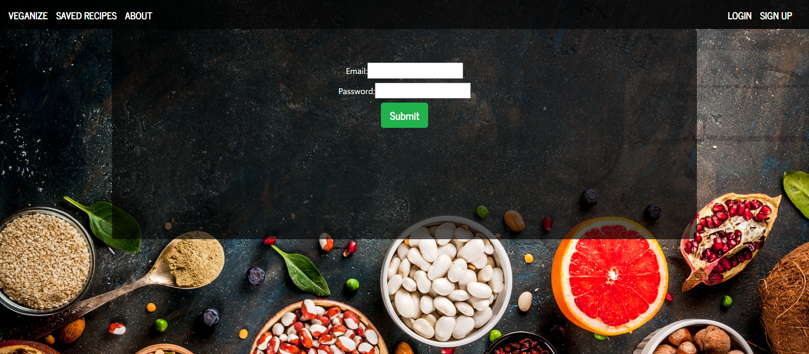

# Project-3

# Purpose and Values
Our project is important because we care about addressing the issues facing our planet's climate. By reducing or eliminating our meat intake, we can drastically reduce the amount of damage done to the environment by the meat industry. Tracy and Ben are vegetarians and aspiring vegans, and Johnny has drastically reduced his meat consumption thanks to products from Impossible meats and Beyond meats and is an aspiring vegetarian. This project is to help more aspiring vegetarians and vegans to find recipes that can help them maintain a meat free diet and for meat eaters to use these recipes to reduce their meat consumption.

# UI Design

This is our home page. It has links to our saved page and about page. The navigation bar also contains links to sign up or log in or log out, depending on if you're already logged in or not.

This is how our collapsible looks once you click on it. It shows a recipe name, recipe picture, and lists the health labels, cautions, and ingredients. 

This is the saved recipe page. If you are not logged in, it shows nothing under saved recipes in the jumbotron. If you are logged in, it shows the list of saved recipes. 

This is the collapsible for the saved recipe page. Right now it shows the user who saved the recipe and the name of the recipe as well as the image for the recipe. 

This page shows users what we are about and our values. 

This is the page where our users will sign up.

This is the page where our users will log in.

# Roles
Ben: API/Front end/routes
Johnny: Mongo/Mongoose/Front end/API
Tracy: JWT/Front end
